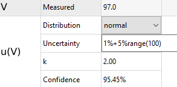

---
title: Suncal User's Guide
date: June 6, 2025
author:
- Sandia National Laboratories^[Sandia National Laboratories is a multimission laboratory managed and operated by National Technology and Engineering Solutions of Sandia, LLC., a wholly owned subsidiary of Honeywell International, Inc., for the U.S. Department of Energy’s National Nuclear Security Administration under contract DE-NA-0003525.]
- uncertainty@sandia.gov

documentclass: report
link-citations: true
...

# Introduction

Suncal, the Sandia Uncertainty Calculator, was developed by the Primary Standards Laboratory (PSL) at Sandia National Laboratories.
The software provides a user interface and Python API for performing various statistical calulations related to metrology and calibration.

## Features

The available calculation types are:

- Uncertainty propagation by the GUM and Monte Carlo methods
- Reverse uncertainty propagation to determine measurement uncertainty required to meet a target combined uncertainty
- Uncertainty sweep to calculate multiple uncertainty propagations over a range of inputs
- Reverse uncertainty sweep to calculate multiple reverse uncertainty propagations
- Analyze measured data sets for repeatability and reproducibility, including computation of autocorrelation and analysis of variance
- Curve fitting, accounting for uncertainty in x and y measurements, and providing uncertainty in the output curve
- Calculation of features in discrete measured waveform data, such as maximum value, minimum value, and rise/fall times.
- Global risk analysis for determining probability of false accept and false reject and guardbanded acceptance limits
- Calibration interval analysis for finding optimal interval lengths
- End-to-end Measurement Quality Assurance calculations based on NCSLI Recommended Practice 19 (draft)
- T-Table calculator for determining values based on a Student's-t distribution

Suncal has a number of features that differentiate it from other uncertainty software solutions:

- The GUM method is solved symbolically, providing the user with the actual formulas used, not just numerical results.
- Automatic conversion of measurement units and dimensional analysis.
- Expanded uncertainties can be calculated automatically based on degrees of freedom and the t-distribution.
- The number of input variables is unlimited, and input variables can have multiple (e.g. Type A and Type B) uncertainty components.
- Over 90 probability distributions are available. If used as a Python module, custom distributions can also be defined.
- Multiple output functions can be computed in parallel, and any output functions may be used as the input to another measurement function.
- Uncertainty propagation can be calculated in reverse to determine how much uncertainty an individual measurement must have to meet a target uncertainty requirement.
- The ability to propagate uncertainty through arbitrary functions, including iteratively-solved functions, using Python code.
- The software is based on Python, a popular language for data analysis as well as communication with hardware instruments.
- Command line interface for embedding Suncal in other programming languages.
- Calculation of uncertainty in curve fitting, including arbitrary curve models.
- Calculation results and plots can be saved in HTML, PDF, Word, or Open Office formats.
- Desktop usage, no internet connection is required and all data stays local.
- Open source software so algorithms can be analyzed at the code level.

## Implementation

Many of the statistics and calculations used in this software leverage the well-established computing packages available in Python, including [NumPy](http://www.numpy.org), [SciPy](http://www.scipy.org), and [SymPy](https://www.sympy.org/).
The SymPy package allows this software to provide and solve symbolic equations for uncertainty propagation rather than relying on numeric methods.
SciPy contains a vast collection of statistical methods and probability distribution definitions that are used throughout this software.
The Monte Carlo simulations make use of the Mersenne Twister random number generator as implemented in SciPy, generally regarded as a quality Pseudo-Random Number Generator (PRNG) for Monte Carlo methods.

## Installation

Suncal's user interface is available on Windows and Mac operating systems. For Linux systems, install and run as a [Python package](#python-usage).
On Windows, two options are available. A standalone EXE file can be run without administrator privileges. If admin rights are available, an installer EXE can be run to install the program for faster operation. On Mac operating systems, the APP can be copied to the Applications folder and run directly from there.

When the user interface is launched, top menu is displayed (see {*@fig:startup}).
There are two general categories of calcuation types: Uncertainty Components, and Statistical Tools.
Uncertainty components include GUM uncertainty propagation, repeatability and reproducibility, and curve fitting uncertainty calculations.
The statistical tools include global risk calculations, calibration interval assessment, and end-to-end measurement quality assurance.
Additionally, an "All-in-one" option combines GUM uncertianty, repeatability/reproducibility, and curve fitting into a single tool.
Select one of the calculation types, or alternatively load a setup file from disk using the **Project** menu.
The **Project** menu also contains options for adding other types of calculations, saving the current setup, or saving a report of all output results.

{#fig:startup}

The following sections list the specific details of each calculation type.

# Uncertainty Calculations

The Uncertainty Component calculations take measured data or a measurement model and compute the uncertainty assoicated with that measurement.

## Uncertainty Propagation

The uncertainty propagation function uses the method described in the GUM [@GUM] and GUM Supplement 1 [@GUMS1] to approximate the combined uncertainty $u_c$ of a measurement function of multiple input variables $f = f(x_1, x_2, ... x_n)$. The GUM method is an approximation based on a first-order Taylor series expansion of the measurement function, solving for the uncertainty using:

$$u_c = \sqrt{ \sum_{i=1}^{N} \left(\frac{\partial f}{\partial x_i}\right)^2 u(x_i)^2 + 2\sum_{i=1}^N \sum_{j=i+1}^N \frac{\partial f}{\partial x_i} \frac{\partial f}{\partial x_j} u(x_i, x_j)}$$

where $u(x_i)$ is the standard uncertainty in the measured variable $x_i$ and $u(x_i, x_j)$ is the covariance between variables $x_i$ and $x_j$. When possible, the partial derivatives are solved symbolically and a full symbolic expression for uncertainty can be obtained along with numeric values. In the rare case a symbolic derivative is not possible, Suncal will fall back on numerical methods for finding the derivatives.

At the same time, a Monte-Carlo uncertainty propagation is performed in accordance with GUM Supplement 1. Each of the input variables are sampled from their respective probability distributions, and passed through the measurement function to obtain a probability distribution for the output variable. Mean, median, and standard deviation statistics can be pulled from this distribution to summarize the results.

Both calculation methods also provide a method for computing expanded uncertainties. The GUM method uses the Welch-Satterthwaite (W-S) approximation to determine an effective degree of freedom and determine the resulting k-factor for a given confidence interval. It should be noted that the W-S formula is technically only valid for uncorrelated input variables, although Suncal will use it even for problems involving correlations. The Monte Carlo method determines expanded uncertainty intervals by taking either the shortest or symmetric percentiles of the output probability distribution.

### Uncertainty Interface

The standard uncertainty interface provides all options for uncertainty propagation calculations.
Start by clicking the **Uncertainty Propagation** button from the main screen.

{#fig:uncertpropview}

To enter an uncertainty propagation problem, start by defining the measurement model.
Double-click on the name and the expression in the Measurement Model table to edit the values.
Functions can be entered using standard format, similar to that used by Excel, using common mathematical symbols (+, -, *, /).
Powers are entered using either the caret (^) symbol or a double asterisk (**) (the syntax used by the Python programming language).
Along with constants "e" and "pi", several common functions are also recognized:

- sin, asin, sinh, asinh
- cos, acos, cosh, acosh, coth, acoth
- tan, atan, atan2 (y, x), tanh, atanh
- log (base e), ln (base e), log10 (base 10)
- sqrt
- root (e.g. root(x, 3) for cube root)
- exp
- radian, degree

Most Greek symbols are recognized by typing their names in English: "theta," "delta," etc. and will be displayed as symbols.
After entering an expression, the field should render the expression as a math formula.
If the field turns red, there was an error parsing the expression, which could mean a missing parenthesis, unrecognized function, or other error.
Additional functions can be entered and calculated in parallel using the plus (+) button or right-click menu to add or remove measurement functions.
These equations may be chained together, for example "f = a + b", and "g = 2*f".
For each function, an optional tolerance may be entered for computing probability of conformance to that tolerance.

Once a function is entered, the **Uncertainties** table is filled in with the variable names extracted from the measurement model equations.
In this table, the nominal measured value, measurement units, and a description of each variable can be entered, along with one or more uncertainty components for each measurement variable.
If a variable has more than one uncertainty component, click the plus (+) button on the right side of the table or right-click on the variable and select **Add uncertainty component.**
When multiple components are present, the standard uncertainty of each component is root-sum-squared together to obtain a standard uncertainty for the variable used by the GUM equation, and the degrees of freedom are combined using the W-S formula.
The Monte Carlo method will separately sample each component before combining.

{#fig:measuredqty}

The items in the **Value** column change depending on what distribution is selected.
Normal and t distributions have values for entering uncertainty with a k value and a confidence percentage.
Entering one value will recompute the other based on the entered degrees of freedom.
Uniform distributions can be entered by using the half-width "a" parameter.
For more information on what the parameters for each distribution are, right-click the uncertainty row and select **Distribution Help**.
The most common distributions are shown in the drop-down list box, but many others can be enabled in the **Preferences** menu.
The distribution is converted to a standard uncertainty for use in the GUM formula, while the Monte Carlo method directly samples each distribution.
The right-click menu also has an option to import distribution settings from a CSV file of sampled data or from another calculation in the project.

#### Relative Uncertainties

The probability distribution fields can also process simple mathematical expressions, including percentages based on the entered mean value.
For example, with a mean of 10, entering an uncertainty of ".5 + 10%" will automatically reduce to 1.5, and be updated appropriately if the mean value is changed later.
When uncertainties are entered as percents or ppm, the standard uncertainty is computed relative to the nominal value for that variable.

Manufacturer's specifications are often given in terms of "percent reading + percent range", or "ppm reading + ppm range". For ease of entry, `X%range()` and `Xppmrange()` functions can
also be entered in the uncertainty field, where `X` denotes the desired percent and the value in parenthesis is the instrument range. For example, if an uncertainty is given
as 1% reading + 5% range, when operating on the 100 V range, enter "1% + 5%range(100)". With a nominal value of 100 V, this expression will reduce to 6 V.

The abbreviations `ppb` and `ppbrange()` can also be used to specify parts per billion, where billion refers to the "short scale" definition, i.e. 1 ppb = 1 part in $10^9$.

{#id .class width=3in #fig:uncertpercent}

#### Entering Units

The Measurement Model and Uncertainties tables allow entry of measurement units.
If omitted, units will be treated as dimensionless.
Otherwise, the entered unit name will be interpreted as a measurement unit.
Many common units and prefixes are recognized either as abbreviations or full names.
For example, "meter", "m", "uF", "m/s^2", "kPa" are all recognized units (corresponding to meter, meter, microfarad, meter-per-second-squared, and kilopascal).
The full name of the unit can always be spelled out to avoid confusion. For example, use "celsius" rather than "C" which results in Coulombs.
Capitalization also matters. "K" results in Kelvin, but "k" is converted to Boltzmann's constant.

Some measurement models may contain empirical constants with units.
These may be entered using a bracket notation "[value units]" in the model expression.
For example, an empirical formula for the speed of sound in air depending on temperature may be entered using the expression:

        [331.3 m/s] + [0.606 m/s/delta_degC]*T

(Note, however, that this model is an approximation that itself introduces potentially significant uncertainty not accounted for in the calculation!)

To check unit compatibility and dimensionality, use the **Check Units** function from the **Uncertainty** menu.
The **Units Converter** option in the **Tools** menu provides basic unit name recognition and conversion and can help ensure a unit name is being interpreted correctly.
Custom units can also be defined in the **Preferences** menu.

Uncertainties do not necessarily need to be the same units as their input variables, for example a nominal value could be in meters with uncertainty in millimeters.
Conversions will happen automatically to produce a result in the units specified in the Measurement Model table.

#### Loading uncertainties from measured data

If the measurements consist of multiple measured values (i.e. Type A uncertainties), the raw measurement values may be entered directly and Type A uncertainty computed automatically.
Click the button **Enter Type A measurement data** in the right most column of the measured values table, or select **Type A Measurement Data** from the **Uncertainty** menu
to display a dialog for entering the measured values (see {*@fig:typeadata}).
Choose the variable from the drop down, and type or paste the measured values into the table. Values may be a single column of repeatability measurements, or multiple
columns of reproducibility measurements. Statistics and the estimated standard uncertainty for the data set will be shown. Click **OK** to migrate the data
into the Measured Values table. If data for multiple variables is entered and the same number of measurements was made for each, the correlation between variables will also
be computed and included in the calculation.

The Type A dialog also provides a button for loading the values from a CSV file, and for importing the results of another Suncal calculation in the project (such as results of a Curve Fit calculation).

{#fig:typeadata}

#### Correlated Uncertainties

If the input variables are correlated, these can be entered on the **Correlations** section (see {*@fig:correlation}).
Correlation coefficients are entered one pair at a time, and must be a value between -1 and +1.
Use the plus (+) button or right-click the table to add or remove correlation coefficients.

{#fig:correlation}

#### Settings

Finally, the **Notes** section contains a field for entering your own information to save with the calculation, and the **Settings** section allows entry of the number of Monte Carlo samples and the random number generator seed.
A seed of "None" will be randomized on every run.

### Outputs

After entering all the details of the uncertainty propagation problem, click the **Calculate** button to run the calculation and show the results.
Use the drop-down list box to select the output to view.
Some of the output views are plots, which can be panned, zoomed, and saved using the plot toolbar below the figure.
Others are text reports, which can be saved by right-clicking on the report.

#### Summary

The Summary view summarizes the results of the calculation, including expected mean values, standard uncertainty, expanded 95% uncertainty, and k factor for both the GUM and Monte Carlo methods.
Additionally, a plot of the GUM method's probability distribution, along with a histogram of the Monte Carlo output distribution, displays (see {*@fig:outputsummary}).
If both methods produce a similar distribution, the GUM method is a valid approximation.

{#fig:outputsummary}

#### Comparison Plots

The Comparison Plots view (see {*@fig:comparisonplot}) shows the same probability distribution plots in an interactive format.
There are options for switching between single and joint probability (if multiple measurement functions are defined), displaying the Monte Carlo result as a histogram or an approximate PDF, and displaying coverage intervals.

{#fig:comparisonplot}

#### Expanded Uncertainties

The Expanded Uncertainties view lists a the expanded uncertainty at a specified confidence interval for both calculation methods.
The Monte Carlo method can show either the symmetric expanded uncertainty (e.g. the 2.5% and 97.5% percentiles for a 95% coverage), or the shortest range that covers the desired percentage of samples [@NPL10].

#### Uncertainty Components

The Uncertainty Components view  breaks down the total uncertainty into components displayed in three tables.
It can be useful to determine which input is the largest contributor to the total uncertainty.
The first table lists all the input variables and standardized uncertainties.
The second table lists the uncertainty components as entered, and as combined for each variable.
The third table lists the sensitivity coefficients.
In the GUM method, these are the solved and evaluated partial derivatives for each input.
The proportions are calculated for each variable from $(c_p^2 + u(x)^2) / u_c^2$ where $c_p$ is the sensitivity coefficient, $u(x)$ is the variable's standard uncertainty, and $u_c$ is the combined uncertainty of the function.
The Monte Carlo method evaluates sensitivity coefficients and proportions by fixing all but one input constant at the mean values, and sampling the variable of interest. The resulting distribution is compared to the distribution of uncertainty including all inputs [@NPL10].

#### GUM Derivation

The GUM Derivation view displays the mathematical derivation used in calculating the GUM uncertainty (see {*@fig:gumderivation}).
Here, the sensitivity coefficients (partial derivatives) are solved and then combined in the uncertainty formula.
Right-click on the window and select **Show markdown** to obtain these formulas in LaTeX-compatible math format if desired.

{#fig:gumderivation}

#### GUM Validity

The GUM Validity view follows the approach in Section 8 of GUM-S1 [@GUMS1].
The endpoints of 95% confidence intervals for the GUM and Monte Carlo methods are compared to a specific tolerance based on the number of significant figures (usually 1 or 2).
If the endpoints agree within this tolerance, the validity test passes and the GUM is a reasonable approximation to the true uncertainty.

#### Monte Carlo Distribution

The Monte Carlo Distribution view displays the output distribution from the Monte Carlo method.
It can be compared and fit to a normal or any other available distribution.
The probability plot of the distribution fit is also given.
When the sample points fall on the straight line, the data fit the selected distribution well.

#### Monte Carlo Inputs

The Monte Carlo Inputs view displays histograms of all the sampled input variables.
They can be plotted as individual histograms or as joint scatter plots to look for the effects of correlation.

#### Monte Carlo Convergence

Suncal runs the same number of samples regardless of the Monte Carlo simulation convergence.
This plot should be checked to ensure that enough samples were run to adequately converge on a mean and uncertainty solution.

#### Full Report

The Full Report view combines all the previous output data into a single page.

## Reverse Uncertainty Propagation

The Reverse Uncertainty Propagation calculator runs the same calculation as the regular Uncertainty Propagation, but in the other direction.
Start a new Reverse calculation by selecting **Reverse Propagation** from the **Project > Insert** menu, or alternatively, convert a regular Uncertainty Propagation into a reverse calculation by selecting **New reverse calculation from model** from the **Uncertainty** menu.
Given a required uncertainty in the output of a measurement model, it will solve for the uncertainty in one of the input variables.
This can be useful, for example, when selecting measurement equipment to use in order to meet a particular uncertainty requirement.

Reverse calculations are solved using both the GUM method and Monte Carlo method.
The GUM method finds the symbolic GUM uncertainty equation and solves it for the variable of interest.
The Monte Carlo method reverses the measurement function and treats the function output as another input variable.
To do this, the Reverse Uncertainty calculator must account for the correlation between the model output and the original input variables.
These correlation coefficients are be estimated using the sensitivity coefficients as described in the GUM [@GUM] C.3.6 note 3.

The Reverse Uncertainty Propagation interface is similar to the standard uncertainty propagation interface, with the addition of a **Target** section.
This section allows entry of the target (mean) value for the function and desired uncertainty for the function.
The input variable to solve for is entered from the drop-down list. Any information about the solve-for variable in the Uncertainties table is ignored.

After clicking **Calculate**, the results will display.
The GUM method shows the solved-for variable's uncertainty in terms of the function uncertainty.
The Monte Carlo method shows the results and a histogram of the reverse Monte Carlo simulation.

## Sweeps

Uncertainty sweeps perform multiple forward or reverse uncertainty calculations over a range of inputs.
The mean value or any parameter defining the uncertainty of any component may be swept over any range of values.
Sweep Calculations may be added using the **Uncertainty Sweep** or **Reverse Uncertainty Sweep** from the **Project > Insert** menu.

The Sweep interface adds a **Sweep** section where the sweep parameters can be defined.
Right-click on the sweep table to add a sweep parameter as a column of the table. A dialog box will appear allowing you to select the sweep parameter (mean, uncertainty, degrees of freedom, or correlation), and the variable to sweep.
If sweeping uncertainty, the uncertainty component and distribution parameter (such as *a* for uniform distributions) can be selected.
A new column will appear in the Sweep table. The table values can be entered manually from the keyboard, or added as a range defined by a start, stop, and step by selecting **Fill Column** from the right-click menu.
Alternatively, the **Import Sweep List** can be selected from the right-click menu to add sweep data from a CSV file or the output of another calculation in the program.
Multiple variables can be swept simultaneously.

When the calculation is run, a summary output window displays. For reverse sweeps, this window includes a table and plot of required input uncertainty for each row of the Sweep table.
For forward uncertainty sweeps, a summary table displays, and the other output views available in forward uncertainty calculations are also available.
Each of these outputs present one calculation of the sweep at a time, and have a slider for selecting a specific sweep index to display ({*@fig:sweepslider}).

{#fig:sweepslider}

## Repeatability & Reproducibility

The Repeatability & Reproducibility (R&R) function (labeled as "Data Sets" in older Suncal versions) allows you to load experimental data for analysis and for use in other uncertainty calculations.

Data values can be entered manually, copied/pasted from Excel, or loaded from a CSV file.
When loading from a CSV file using the **Load data from CSV** menu option, the full CSV file will be shown in a table.
Select the values to import, including any header row or column if applicable. If the data is grouped by rows (i.e. with a header as the left column), check the **Transpose** box.
After clicking **OK**, the values will be loaded into the Data Sets table.
Note that missing data is acceptable, and will be disregarded in the ANOVA calculation; the groups do not have to be the same length.

As an example, each column (group) in the table could be a different measurement temperature, while each row would list one measurement of multiples made at that temperature,
or each column could be a day in which multiple measurements (rows) were taken under identical conditions.

{#fig:datasets}

Once the data is entered, summary statistics for each group (column) are provided in the first table, with statistics for the overall data set given in the second table.
Results of one-way analysis of variance are displayed in the third table.

Use the dropdown to view other statistics on the data set. Other options include a histogram for each column, the correlation matrix between all columns,
autocorrelation and lag plots of a column, and a 1-way analysis of variance where both the F-statistic and P-value are computed.
The groups are statistically equivalent if the F-statistic is less than the critical F value (with 95% confidence), and the P-value is greater than 0.05.

Once a data set is loaded, its statistics can be used in other calculations, such as curve fitting.

#### Data Set Summary Mode

In some cases, only a summary of the measured data is available. The summary must include the mean, standard deviation, and number of measurements for each measurement group.
In this case, select **Enter Summarized Values** from the **Data Set** menu.
The data table will be reduced to three rows: mean, standard deviation, and count.
After entering the summarized values, the group statistics and analysis of variance are shown.

## Curve Fitting

The curve fitting calculation takes x and y data, with optional uncertainty in x and/or y, and computes the best fitting line, polynomial, or exponential function.
It also may be used to extract waveform features from the data points, such as maximum/minimum values, threshold crossing times, or pusle widths.
Data can be entered manually or loaded from a file or an uncertainty sweep calculation.
In contrast to many other curve fitting calculators (such as in Excel), Suncal allows for uncertainty in both x and in y to be entered and accounted for.
The model to fit can be:

- Line: $y = a + bx$
- Polynomial, up to 12th degree: $y = a + bx + cx^2 + ... + kx^n$
- Exponential: $y = a e^{x/b} + c$
- Exponential Decay: $y = a e^{-x/b}$
- Logarithmic Growth: $y = a + b \log{(x-c)}$
- Logistic Growth: $y = \frac{a}{1 + \exp{[(x-c)/b}]} + d$
- Custom Function: Enter any one-line expression with an *x* variable and at least one other parameter to fit.

When run as a [Python package](#python-usage), any arbitrary function can be fit to measured data, including iterative or other complicated functions that cannot be written in one line.

Two regression minimization options are available: vertical distances or orthogonal distances.
Vertical distance regression is the typical approach to curve fitting, providing a fast and simple algorithm.
Orthogonal distance regression is useful for curves with nearly vertical slopes, and also results in identical fit lines when the x and y axes are swapped.
In some modes, an initial guess of the parameters can be used to speed up the minimization calculation.

### Curve Fit Algorithms

The curve fit algorithms are:

- Line with no x uncertainty: `linefit` function described in [@NUMERICALC]
- Line with uncertainty in x: York's algorithm, see [@york] and [@wehr]
- Arbitrary curve, no x uncertainty: Levenberg-Marquadt Algorithm, as implemented in [`scipy.optimize.curve_fit`](https://docs.scipy.org/doc/scipy/reference/generated/scipy.optimize.curve_fit.html)
- Arbitrary curve, with x uncertainty: Orthogonal Distance Regression, as implemented in [`scipy.odr`](https://docs.scipy.org/doc/scipy/reference/odr.html)

### Uncertainty in Curve Fitting

There are four methods in the **Settings** tab for propagating uncertainties through the curve fitting algorithm.

- The Least Squares method is an analytical method for propagating uncertainties as defined in the above algorithms.
- The Monte Carlo method will sample every data point over its uncertainty multiple times and compute multiple possible curve fits. The parameters for the set of fits are averaged to determine the mean and uncertainty of each fitting parameter.
- The Markov-Chain Monte Carlo method uses a Bayesian approach with the Metropolis-in-Gibbs algorithm. See [@mcmc].
- The GUM method here uses the GUM uncertainty propagation formula, where the measurement function is the curve fitting algorithm and every measured x value and y value are inputs into the function. The partial derivatives in this method must be calculated numerically, as no symbolic solutions can be computed for the iterative curve-fitting algorithms.

In general, the Least Squares method is preferred, as it is analytical, fast, and the uncertainties result from of the curve-fitting algorithms themselves.
However, multiple methods can be run and compared.

The option **Treat uncertainties as relative values** allows entering u(y) and u(x) in a relative, weighted, sense.
When this is checked, absolute magnitudes of the entered uncertainties are unimportant; they will be scaled to match the sample variance of the residuals after the fit.
For more information, see documentation of `scipy.optimize.curve_fit`.

### Use of dates in curve fitting

Frequently, measurements are made over the course of days or years to look for drift in a device's value.
This requires using date and time values on the x axis.
One easy approach is to convert every date into a decimal year, or perhaps the number of days since the first measurement was made.
If traditional dates are desired, select the **X Values are Dates** check box. Data in the x column can then be entered in standard date formats, such as month-day-year.
Valid entries include "9/25/2019," "9-25-19," and "25-Sept-2019."
Internally, the dates are converted to ordinal time before being applied to the curve fitting algorithm, then converted back to date strings for use in the output plots and tables.

### Fit Curve and Uncertainty

{#fig:curvefitoutput}

After the x, y data is entered, click **Calculate** to show the results.
The Fit Plot view shows the fit line and optionally the confidence and prediction bands, expanded to the desired confidence level.
Fit coefficients and their uncertainties are displayed below the plot, along with goodness-of-fit metrics.

For straight line fits, the confidence band determines the confidence that the data is actually following this fit line. It is calculated from

$$u_{conf}(x) = \sigma_y \sqrt{\frac{1}{N} + \frac{(x - \bar x)^2}{\Sigma (x_i - \bar x)^2}}$$

where $\sigma_y$ is the uncertainty in an individual measurement, $\sigma_B$ the uncertainty in the slope parameter, $N$ the total number of measurement points, and $\bar x$ the average of the measured x values.
Similarly, the prediction band should be used to predict the uncertainty in a new measurement at any x value on the line. It is calculated from

$$u_{pred}(x) = \sigma_y \sqrt{1 + \frac{1}{N} + \frac{(x - \bar x)^2}{\Sigma (x_i - \bar x)^2}}$$

The $\sigma_y$ value to use in the prediction band will depend on the particular problem. Three options are available from the user interface:

1. **Syx (Residuals)**. This is the default option that uses the standard error of the fit Syx and applies this value to every x-value at which a prediction is made. This is the only option when u(y) is not entered.
2. **Interpolate u(y)**. When u(y) is entered, these values can be used to determine $\sigma_y$. But since u(y) is only specified at specific x-values, $\sigma_y$ must be extrapolated (linearly in this case) to the desired x-values at which predictions are made.
3. **Last u(y)**. Applies the last entered u(y) value to all x values. This option is useful, for example, when the x-axis is time and any new measurements in the future will use the same equipment uncertainty as the last measurement. The resulting prediction band should not be used to evaluate past measurements made under different measurement uncertainty conditions.

The confidence band and prediction band can be generalized to nonlinear curve fits using the gradient, where $C$ is the covariance matrix of the fit parameters:

$$u_{conf}(x) = \sqrt{\nabla f^T \cdot C \cdot \nabla f}$$

$$u_{pred}(x) = \sqrt{u_{conf}^2 + \sigma_y^2}$$

### Residual Plots

The Residual plots provide diagnostic tools on the regression. A histogram, a plot of the raw residuals, and normal probability plot can help determine whether the selected model (line, polynomial, etc.) is adequate to describe the data.
If the model is adequate, the residuals are expected to fall in a roughly normal distribution centered at 0.

### Correlations

The Correlations view shows the correlation coefficient between the fit parameters. In some problems, the slope and intercept may be highly correlated, for example.

### Tolerances

On the Curve Fit input page, use the **Tolerances** tab to enter any tolerances assoicated with the fit parameters.
The tolerances will be used to compute probability of conformance with the tolerance.
For example, contact resistance is determined from the y-intercept of a line fit to measured resistance vs length data points.
Enable the tolerance on fit parameter **a** to determine whether that contact resistance meets its specification.
The computed probability of conformance values will be displayed below the computed fit parameters.

### Predictions

Use the **Predictions** tab on the input page to enter one or more x values at which to predict a y value and its uncertainty.
Each prediction has may be given a name, and an optional tolerance used for computing probability of conformance to that tolerance.

Select **Prediction** from the output type dropdown to view the predicted values.

### Waveform Features

Various waveform features and their uncertainties may also be extracted from the data points. Features include:

* Maximum value and time of maximum value
* Minimum value and time of minimum value
* Peak-to-peak value
* Rise and Fall Time (defined as time between 10% and 90% of peak-to-peak)
* Threshold crossing time (rising or falling edge)
* Pulse Width defined as Full-width Half-Maximum

These features and uncertainties are calculated using the methods in [@delker].
On the **Waveform** tab, add features to compute using the **+** button.
For each feature, enter a unique name and select the feature type.
For threshold crossings, a threshold value must be entered. The **Clip Low** and **Clip High**
values may be entered to limit the range over which to compute. This may be useful, for example,
when computing a rise time and fall time to only focus on the relevant part of the waveform.
Each feature may take an optional tolerance for computing probability of conformance to that tolerance.

Select the **Waveform Features** from the dropdown on the output page to view the feature values and plot individual features.

# Statistical Tools

Additional tools are available for computing common statistical functions used in metrology.

## Measurement Decision Risk

Specific risk calculations are available directly in the above uncertainty component tools by entering tolerances where appropriate.
For global (average) risk calculations, select the Global Risk tool.
It computes the risk associated with process and/or test distributions falling outside of specification limits.

### Simple Risk Tool

A simplified risk calculation tool is always avaliable by selectin **Risk Calculator** from the **Tools** menu. In this tool, the risk calculation follows [@deaver] by assuming normal distributions and symmetric acceptance limits.
Parameters are entered in terms of a test uncertainty ratio (TUR), in-tolerance probability (itp), and guardband factor.

{#fig:risksimple}

### Global Risk

By selecting **Global Risk** from the main project menu, a more full-featured risk calculation is presented.
Probability distributions for the process/population and the test measurement are entered, along with absolute acceptance limits and guardband limits.
Unlike the Simple Risk Tool, no assumptions are made about distribution type; non-normal distributions can also be entered and are integrated numerically using the same approach.
The "Process Risk" considers only the process distribution, and is calculated as the probability of the process distribution falling outside the limit.
The "Specific Measurement Risk" considers only the measurement distribution, and is given in terms of the specific risk for the entered measurement value and as the worst-case
specific risk that typically occurs when a value is measured on one of the acceptance limits.

The "Global Risk" column calculates the total probability of false accept and total probability of false reject as the double integral of the product of the two distributions falling outside the limits.

An optional guardband can be entered, as a relative offset to the specification limit; for example, with an upper specification limit of 2 and guardband of 0.1, the product will be rejected with a measurement over 1.9.
The **Risk** menu provides an option for computing a guardband.
The guardband can be computed using one of several common methods (such as the RSS method $k = \sqrt{1-1/TUR^2}$), or by targeting a specific false accept probability.
This method uses a numerical minimization technique to solve for the limits on the double integral, and so may not always converge or hit the target exactly.

{#fig:riskanalysis}

The **Calculation** dropdown allows selection of different calculations on risk.
"Risk"" mode calculates PFA and PFR by numerically integrating the joint probability distribution.

The "Guardband Sweep" mode plots how PFA and PFR change with different guardband factors and can be useful for finding an optimal trade off between false accept and false reject.
"Probability of Conformance" mode plots the probability that a given measurement result is a conforming product, useful when no prior information is available on the distribution of possible products.

### Risk Curves

A Risk Curves Tool, available from the **Tools** menu, generates sweeps of PFA and PFR with TUR, itp, guardband factor, and bias.
One of these variables must be selected as the sweep (x) value, and another can optionally be selected as the step (z) variable.
The remaining variables are set as constants.
The sweep values can then be entered by defining a start value, stop value, and the number of sweep points.
Step values are entered as a comma-separated list of individual values.
{*@fig:risksweep} shows plots of the familiar PFA vs. itp with TUR from 1.5 to 4.

{#fig:risksweep}

## Calibration Intervals

The Calibration Interval Analysis tool assists in determining optimal calibration interval lengths given historical data on calibration assets.
Upon selecting the Calibration Intervals button, a window is displayed with some options for what type of data is available.
The calculation method depends on whether only pass or fail states are known for historical calibration data, or if actual values were saved.

The Test Interval method, commonly referred to as "Method A3" from its name in NCSLI RP-1 [@RP1], is used when only pass/fail values are available and all the
historical calibration data had equal or similar assigned intervals.
The Binomial Interval method, referred to as "Method S2" from RP-1, uses pass/fail data but requires historical intervals of many different lengths.
The Variables interval method should be used if actual values, not just pass/fail status, were recorded at each historical calibration.

The dialog also has a choice of how to enter the data, whether all data from each individual calibration (such as start and end dates and pass/fail status),
or summarized reliability values (such as 10 assets were in-tolerance out of 12 assets calibrated).

Once these selections are made, the interval calculator is shown.

When entering data on individual assets, new assets can be added or removed using the **+** and **-** buttons.
Pass/fail statistics from all assets will be combined for the calculation.
In all calculation modes, calibrations can be entered using calibration dates only, or interval start and end dates by checking **Enter start and end dates**.
When start dates are not available, the first calibration is not included in the calculation because its interval length is not known.
Dates may be entered in several common formats, including dd/mm/yyyy or dd-mm-yyyy. To eliminate ambiguity, it is suggested to spell out month abbreviations such as "19-Aug-2020".

Pass and fail status may be entered as "pass" or "fail", or as 1 or 0 values. To ignore a calibration (such as when an adjustment or repair was made) but still include it in the list, enter "N/A" or "none".

When the calibration data has been entered, fill out the options for the interval calculation type and hit **Calculate** to see the results.

{#fig:intervalA3}

The A3 method lists the suggested new calibration interval and other statistics. The rejection confidence gives the confidence with which one can reject the current interval in favor of the new interval. Often, if the confidence is higher than 50%, implementing the new interval is a good choice.
In method S2, several reliability models are fit to the time vs. reliability data. The best fitting model is shown first,
followed by its plot. Then all the models that were tested are listed along with their rejection confidence and figure of merit.
Higher figure of merit, and lower rejection confidence, gives more assurance that the model does fit the data and the suggested interval should be implemented.
The Variables method predicts deviation in calibrated value over time, and sets the interval to limit the uncertainty or unreliability from getting too high.
The suggested interval from both methods is shown with plots depicting when the predicted uncertainty or reliability exceeds the limits.

For more information on the calculations behind the A3 and S2 methods, and the different options for the calculation, see NCSLI RP-1 [@RP1].
NASA Handbook 8739 [@NASA8739] details the calculations and options used in the variables method.

## End-to-end Measurement Quality Assurance (beta)

Suncal provides a beta-version implementation of the end-to-end measurement quality assurance (MQA) model described in the draft
of NCSLI Recommended Practice 19 [@RP19].

Select the **End-to-end MQA** button to add this calculation.
Multiple end-item quantities may be added to the table.
For each quantity, enter the details into the table. Some columns include popup menus providing more options.
Additional columns may be shown by selecting the options from the **MQA** menu.
Columns include:

- **Quantity**: Name of the quantity
- **Testpoint**: The testpoint or nominal value of the quantity
- **Units**: Measurement units (for recordkeeping only - no units conversion is currently done)
- **Tolerance**: The tolerance or specification being measured on this quantity
- **Utility**: Enter performance limits if different than the tolerance limit
- **EOPR**: End-of-period reliability of the quantity. Use the dropdown to switch between Observed (measured using the same equipment in the table) or True (determined using other more accurate means).
- **Equipment**: Enter the equipment specification used to check this quantity. Use the dropdown to select different options:
  + **Tolerance**: A tolerance plus reliability
  + **Equipment List**: Select predefined equipment from the equipment list, and the accuracy will be calculated from the testpoint
  + **Another Quantity**: Use the tolerance and average-over-period reliability of another quantity in the table
  + **Indirect Measurement**: Combine multiple measurements using the GUM equation
- **Guardband**: Enter the acceptance limit, or select from the guardbanding policies
- **Measurement**: Enter a renewal policy and historical calibration interval. The dropdown allows exploring new intervals along the same reliability decay curve.
- **Costs**: Provides entry of cost model details

The results are computed immediately as the data is changed, and may be seen by expanding the results panel on the right side of the window.
Different results may be displayed using the dropdown menu in the upper right.
The **Reliability** option shows the beginning-of-period, end-of-period, and average-over-period reliabilities, along with global probability of false accept and reject of the item.
The **Uncertainty** dropdown shows the measurement uncertainty, accounting for all upstream calibrations.
Three options in the dropdown allow for viewing plots of reliability curves.
Finally, the **Costs** option shows a summary of calibration and performance costs for the device.

A full report of all quantities is available by clicking the "Generate Report" button in the lower right of the window.

{#fig:mqa}

## Distribution Explorer

You can draw random samples from distributions and perform manual Monte Carlo simulations from the Distribution Explorer window, available from the **Project > Insert** menu.
It is included in the calculator software mainly for educational purposes.
To run a Monte Carlo simulation, define one or more Input Distributions, and add another distribution but set the its name field to a formula using the previously defined expressions as inputs. Expressions should be entered using the same syntax as the [Uncertainty Propagation](#inputs) function input.
Click **Sample** to pull random samples from a distribution and see the resulting histogram. A distribution can be fit to the sampled data and probability plot shown to validate the fit to the data.

## T-Table Calculator

From the **Tools** menu, select **T-Table** for a dialog box that calculates values based on the Student-t distribution (see {*@fig:ttable}).
The calculator can solve for the coverage factor k, the confidence level, or the degrees of freedom when given the other two parameters.
A comparison plot of a normal and a t-distribution with the given degrees of freedom is also shown as a reference.

{#fig:ttable}

# Projects

Multiple calculations can be run and the results shared between calculations using a Project.
The calculations are added to the Project by selecting **Add new calculation** from the **Project** menu.
All calculations are shown in the project tree (accessible from the **Window** menu). Here, calculations can be added, removed, and renamed.

## Saving and Loading

The setup configuration for every calculation in a Project can be saved to a file and loaded back from a file using the **Project** menu.
These files are saved in yaml (plain text) format. They can have a ".yaml" or ".txt" file extension.
The **Examples** folder in the source repository contains several saved projects for reference.

## Data sharing

In many calculation functions, data from one calculation result can be loaded as the input to another calculation (select **Type A Measurement Data** from the **Uncertainty** menu, then click **Import From**).
For example, the prediction band at a specific x value of a curve fit calculation can be used as an uncertainty component in an Uncertainty Propagation calculation.
Results of an uncertainty sweep or ANOVA data set can be loaded into a curve fit calculation (by selecting **Insert Data From Project** from the **Curve Fit** menu)
or even another sweep calculation.
Double-click the desired data source in the **Data Source** table.
Importing data is a one-time event. If the original calculation data changes, the data will need to be re-imported into the second calculation.

{#fig:importdistribution}

 provides some examples.

## Reports

The calculation-specific menu always contains an option to save the currently displayed report.
Reports from all calculations in the Project can be saved to the same file from the **Project** menu.
Right-clicking on any text-based output report displays a Save option in the context menu for saving that particular output.

Reports can be saved in several formats, including HTML, Markdown, PDF, Open Office ODT, and Microsoft Word.
HTML and Markdown reports are always available.
Open Office, Word, and PDF all require [Pandoc](http://pandoc.org) to be installed to run the document conversion.
The PDF format also requires [LaTeX](https://www.latex-project.org).
Under Windows or Linux, the `pandoc` and `pdflatex` programs must be available on the system PATH for these formats to be available.
On Mac OSX, Pandoc will be found if it was installed using the standard installer, and pdflatex will be found if installed from MacTex.
Alternatively, the **Preferences** window allows entry of customized installation locations.

Figures in HTML and Markdown can be drawn in either SVG (vector) or PNG (raster) format. SVG will provide the best results but may not work on older browsers.
Math can be rendered using Matplotlib, which does not require any internet connection, or using the JavaScript MathJax script, which by default is downloaded from the public MathJax server.
In either case, the resulting HTML file is stand alone, and all graphics and equations are embedded in the HTML/Markdown file itself.

## Settings/Preferences

A **Preferences** window allows you to change some common settings, including:

- Plot style, colors, and other plotting parameters
- Significant figures and number formats to show in reports
- Probability distributions to show in drop down lists
- Custom unit definitions

These settings will remain in place the next time the program is opened.

# Python API

The back end of Suncal can be installed and run as a Python package to allow greater flexibility in defining the calculations, loading input data, and processing the results.
Running as a package allows for uncertainty propagation through arbitrary functions, curve fitting to any curve, and loading/saving data to any file format available to Python.
It can also run uncertainty propagation calculations on complex valued (real and imaginary) measurement models natively.

The Python package can be installed using pip:

        pip install suncal

or by downloading the source code, navigating to the source folder, and running:

        pip install .

Suncal can be imported into your code with

        import suncal

Refer to the docs folder of the source code repository for API documentation and examples in Jupyter Notebook format.

# Command line usage

Once the Python package is installed, a command-line interface to Suncal is available.
This allows for Suncal's algorithms to be used within other programming languages and scripts such as LabView, Metcal, or R.
The following command line programs are installed with the Python package:

- `suncalui`: Launches the user interface
- `suncal`: Calculates an uncertainty propagation
- `suncalf`: Calculates all items in an uncertainty project file
- `suncalrev`: Reverse uncertainty propagation
- `suncalrisk`: Risk analysis calculation
- `suncalfit`: Curve fit uncertainty calculation

Each command can be run with the '-h' flag to see all the arguments for that command.
For example, running `suncal -h` prints:

        usage: suncal [-h] [--units UNITS [UNITS ...]] [--variables VARIABLES [VARIABLES ...]]
                       [--uncerts UNCERTS [UNCERTS ...]]
                       [--correlate CORRELATE [CORRELATE ...]] [-o O]
                       [-f {html,txt,md}] [--samples SAMPLES] [-s] [--verbose]
                       funcs [funcs ...]

        Compute combined uncertainty of a system.

        positional arguments:
          funcs                 Measurement model functions (e.g. "f = x + y")

        optional arguments:
          -h, --help            show this help message and exit
          --units UNITS [UNITS ...]
                                List of units for each function output
          --variables VARIABLES [VARIABLES ...]
                                List of variable measured values (e.g. "x=10")
          --uncerts UNCERTS [UNCERTS ...]
                                List of uncertainty components, parameters separated
                                by semicolons. First parameter must be variable name.
                                (e.g. "x; unc=2; k=2")
          --correlate CORRELATE [CORRELATE ...]
                                List of correlation coefficients between pairs of
                                variables. (e.g. "x; y; .8")
          -o O                  Output filename. Extension determines file format.
          -f {html,txt,md}      Output format for when output filename not provided
                                ['txt', 'html', 'md']
          --samples SAMPLES     Number of Monte Carlo samples
          -s                    Short output format, prints values only. Prints (GUM
                                mean, GUM std. uncert, GUM expanded, GUM k, MC mean,
                                MC std. uncert, MC expanded min, MC expanded max, MC
                                k) for each function
          --verbose, -v         Verbose mode. Include plots with one v, full report
                                with two.

All command-line programs (except the user interface) take arguments **-o**, **-s**, and **-v** to control the output.
Use **-s** to provide short, abbreviated output, printing the numbers only to stdout, for easy parsing by external programs.
Use the **-v** or **-vv** option to report additional information in the output.
The **-o** option, followed by a filename, will save the output report to the file in the format specified by the file extension, which can be html, pdf, docx, or odt.

## Command Line Examples

### Uncertainty Propagation

Calculate uncertainty of model $f = ab + c$ with a and c as normal distributions and b as a uniform distribution. Additionally, add correlation coefficients between a and b and between b and c:

        suncal "f=a*b+c" --variables "a=10" "b=5" "c=3" --uncerts "a; std=1"
          "b; dist=uniform; a=.5" "c; unc=3; k=2" --correlate "a; b; .6" "c; b; -.3"

Output:

        f = a b + c

        Method            |Mean |Standard Uncertainty
        ------------------|-----|---------------------
        GUM Approximation |53.0 |7.1
        Monte Carlo       |53.2 |7.1

Adding the '-s' option results in:

        53, 7.09265572, 13.9013666, 1.95996636, 53.1622797, 7.07130974, 40.0791191, 67.2999898, 1.92474037

### Risk Analysis

Compute risk given specification limits of -8 and +8, with a process distribution standard deviation of 4 and test distribution standard deviation of 1.

        suncalrisk --procdist "loc=0; scale=4" --testdist "loc=0; scale=1" -LL -8 -UL 8

Output:

        Process Risk                             |Test Measurement Risk     |Combined Risk
        -----------------------------------------|--------------------------|-----------------
        Process Risk: 4.55%                      | TUR: 4.0                 |Total PFA: 0.78%
        Upper limit risk: 2.28%                  | Measured value: 0        |Total PFR: 1.47%
        Lower limit risk: 2.28%                  | Result: ACCEPT           |
        Process capability index (Cpk): 0.666667 | PFA of measurement: 0.00% |

### Line Fit

Fit a line through the points (1, 0.5), (2, 1.2), (3, 1.8), (4, 2.4), (5, 2.9), (6, 3.6) using Least-Squares fit:

        suncalfit -x 1 2 3 4 5 6 -y .5 1.2 1.8 2.4 2.9 3.6

Output:

        Method        |b     |u(b)  |a      |u(a)
        --------------|------|------|-------|------
        Least Squares |0.606 |0.014 |-0.053 |0.053

Adding the '-s' option results in:

        0.605714286, -0.0533333333
        0.0135023304, 0.052584022

# Example Calculations

## RC Circuit Uncertainty

In this example, a Resistor-Capacitor (RC) circuit is constructed from off-the-shelf components.
The time constant of the circuit is calculated with

$\tau = R_1(C_1 + C_2)$.

The components are given with tolerances, and thus are interpreted as uniform distributions.

| Component  | Value         | Uncertainty
|------------|---------------|-------------|
| $R_1$      | 5 k$\Omega$   |  1%         |
| $C_1$      | 0.22 $\mu$F   |  5%         |
| $C_2$      | 0.1 $\mu$F    |  1%         |

To determine the time constant and its uncertainty using Suncal, set up a new Uncertainty Propagation calculation.
Enter the measurement model name (`tau`) and expression (`R*(C1+C2)`) as shown in {*@fig:rcrisktau}.
The Uncertainties table will fill in with the variable names.
Enter "ms" in the units column to obtain the resulting time constant and uncertainty in milliseconds.

{#fig:rcrisktau}

Next, enter the nominal value for each component in the Nominal column.
Enter units for resistance of "kohm" and for the two capacitors of "uF".
One uncertainty component for each variable is added by default.
For each of the variables, click the row in the Uncertainties table, and change the uncertainty distribution for the uncertainty component to **uniform**.
The "a" parameter is the half-width of the distribution. In this case, "a" can be entered as a percent ({*@fig:rcriskinput}).
Optionally, add a description for each variable and the measurement model.

{#fig:rcriskinput}

Now that the model is fully entered, click **Calculate** to find the total uncertainty.
One can immediately see the GUM method and Monte Carlo method produce similar standard uncertainty values (0.033 ms), yet give very different probability distribution shapes.
This is because the GUM method is normalizing all the uniform distributions before calculating its solution.

{#fig:rcriskoutput}

### Risk Analysis

Many circuits using these components will be manufactured with the specification that the time constant must be between 1.55 and 1.65 ms.
What is the probability that any given circuit will fall outside the specification?

The uncertainty propagation above determines the uncertainty of an average or typical RC circuit, while individual circuits will be measured to determine their compliance. While the Tolerance feature in the Uncertainty Propagation tool could be used, it would determine the probability that an average RC circuit conforms with the tolerance, without regard for any test measurements made on individual circuits.
Because the question deals with averages, a Global Risk calculation is needed. 

From the **Project** menu, select **Add Calculation** and choose **Global Risk**.
The previous uncertainty propagation problem provides the Process Distribution needed for the risk calculation.
This distribution can be automatically copied into the Process Distribution using the **Risk** menu and selecting **Import distribution**.
From the dialog box, different distributions that have already been calculated are available for loading into the Risk calculation.
Double click **uncertainty** as the Data Source, then click **tau (MC)** in the table to view the Monte Carlo results of the original uncertainty calculation (see {*@fig:riskprop}).
Next, specify that this column should be imported as the Process Distribution by selecting **Process Distribution** from the **Assigned Variable** dropdown.
With sampled data results from a Monte Carlo, different distributions can be fit to the histogram by selecting different options from the **Distribution to Fit** dropdown list box.
To approximate the distribution using a histogram, select **histogram** from the list of distributions to fit, then click **OK**.
The histogram probability distribution will be loaded into the process distribution in the risk calculator.

{#fig:riskprop}

Enter the lower and upper specification limits of **1.55** and **1.65**.
In the Process Risk column of the table, the total process risk is calculated as 12.73% (your results may vary slightly due to the random nature of the Monte Carlo simulation).
This is the probability that any given part made from these components will fall outside the acceptable time constant limits.

Next, the RC circuits are each measured to determine whether they fall within the acceptance limits. The measurements are made with a measurement uncertainty of 0.01 ms.
This corresponds to the Test Measurement distribution. Enter a test measurement standard deviation of **0.01** and median of **1.6** (see {*@fig:riskrc}).
Now the Combined Risk column in the table is calculated to give the total risk of measuring, yet accepting, a bad part (probability of false acceptance [PFA]), and the risk of rejecting a good part (probability of false reject [PFR]).

The slider control next to Median in the test measurement can be used to explore results of a specific test measurement. The combined risk calculation integrates the combined distribution over all possible median values.

{#fig:riskrc}

## Contact Resistance

When new nanoscale materials, such as semiconductor nanowires, are developed, one of the key properties that needs to be characterized is the resistance between the nanowire and the electrical contacts made to it.
One common technique to measure the contact resistance is to place multiple contacts along the nanowire with different spacings between them.
The resistance between each pair of contacts is measured and plotted as a function of length.
A line is fit to the data points and extrapolated back to zero length.
The y-intercept of this point should include only resistance from the two contacts, and not the nanowire itself.

Suncal can be used to both fit the line and determine the uncertainty in extracting the y-intercept.
Start with a Curve Fit calculation.
In the **Curve Fit** window, enter x values of the different lengths between contacts, and y values of the resistance measurement.
If uncertainty in the resistance is known, those values can be entered in the u(y) column.
Note that the x and y column labels can be changed to Length and Resistance for properly labeled plots.
In this example, measured length and resistance values are saved in the "contactresistance.txt" file in the Examples folder.
Import the data in this file by selecting **Insert Data From** from the **Curve Fit** menu, double-clicking **Select CSV File**, and selecting the contactresistance.txt file.

After clicking **OK**, the data will display in the preview plot.
The curve fit function and options can be selected. Here, the default of fitting a line using vertical distances is sufficient.

We are interested in the resistance at zero length. In the **Predictions** tab, enter a new prediction value, named "2Rc", with X-Value of 0. 

Click **Calculate** to display the fit line and its prediction band.
The slope and intercept, their uncertainties, and goodness-of-fit parameters are shown.
Select **Prediction** from the drop-down list box to see the curve predicted at 0 length.
The predicted value and its uncertainty are plotted as the orange errorbar and shown in the table (see {*@fig:contactresistance}).
For these measurements, the contact resistance ($\times2$ for the 2 contacts) is 50.91 kOhm with 95% uncertainty of 34.36 kOhm.
Dividing by two to obtain the resistance of a single contact gives

$R_c = 25.5 \pm 17.3 \mathrm{k}\Omega$.

{#fig:contactresistance}

## Selection of calibration provider for density measurement

The density of a gage ball must be calibrated by measuring the diameter and mass. Density is found using the formula:

$$\rho = \frac{6 m}{\pi d^3}$$.

The nominal values of the gage ball are 86.03 g $\pm$ 10 mg and 22.225 mm $\pm$ 5 $\mu$m, leading to a nominal density of 14.967 $g/cm^3$.
A calibration provider must be found who can meet a combined density uncertainty of 0.04 $g/cm^3$ (k = 2).

This problem involves using a reverse uncertainty propagation in order to find the input uncertainty to meet an output uncertainty requirement.
Because there are two free variables (density and mass), there are infinite solutions to the problem.
However, one variable can be sweept while solving the reverse uncertainty requirement for the other variable, and any solution falling under the resulting curve will be acceptable to meet the maximum density uncertainty.

To enter this setup into Suncal, add a **Reverse Sweep** to a new Project by selecting **Reverse Sweep** from the **Project > Insert** menu.
Enter the measurement model and nominal quantities for mass and diameter.
Add the mass and diameter uncertainties, including the different units (mg and $\mu$m).
Next, enter the target uncertianty under the **Target** section.
The function to solve is **rho**, the target value is **14.967**, and target uncertainty is **0.02**. Note the k = 1 value should be entered here. The target values assume the same units ($g/cm^3$ in this case) as the model units entered above.
Solve for the mass variable ({*@fig:densityrevsweep}), and then use the **Sweep** section to set up a sweep of uncertainties on the diameter variable.

{#fig:densityrevsweep}

Under the **Sweep** section, press the Plus Sign (**+**) button to add a new sweep column. The Sweep Parameter is **Uncertainty**, variable is **d**.
Because this diameter is a single standard normal uncertainty, there is only one option for component and parameter.
After clicking **OK**, a new column is added to the Sweep table. Press the Ellipses (**...**) button to enter a range of values for diameter uncertainty to sweep.
Set the range from 1 to 9 with count of 9. The units will match the units entered for the swept variable, in this case, $\mu$m entered for the diameter uncertainty.

{#fig:sweepentry}

After clicking **Calculate**, nine reverse uncertainty propagations are run for each of the nine values in the Sweep table.
The results are shown ({*@fig:revsweepoutput}) with a plot of mass uncertainty vs. diameter uncertainty. Any calibration provider falling below this line is acceptable to meet the density uncertainty requirement.
Note you may want to use the **Preferences** menu to increase the number of significant digits shown. By default, uncertainties are displayed with 2 significant figures (by recommendation of the GUM), so the first few lines of this table may appear identical.

{#fig:revsweepoutput}

## Risk analysis of drifting asset

A pressure gauge was calibrated five times and is showing predictable drift.
A value between 175 and 185 PSI is considered in tolerance.
As the gauge is drifting closer to the upper limit, what is the probability that it will drift out of tolerance by the next calibration due date?

The gauge was calibrated five times, each with five measurements. This data is stored in the "pressure.txt" file in the Examples folder.
Because this is a measured data set, start with a Data Sets and Analysis of Variance calculation.
From the **Data Set** menu, choose **Load Data from CSV** and select the "pressure.txt" file.
The data is laid out in rows, where the first column is the calibration date and the remaining colunms are repeated measurements on that date, so check the **Transpose** box.
The plot now displays a single mean value with uncertainty bars at each date, effectively finding the mean and uncertainty of the five measurements on each date.

{#fig:groupdata}

To predict the drift over the next year to the calibration due date of July 1, 2019, select **Add Calculation** from the **Project Menu** and select **Curve Fit**.
Import the data we just loaded into the curve fit by selecting **Insert Data From** from the **Curve Fit** menu.
Double-click **Summarized Array** to select it as the data source.
Suncal will predefine the first columns as x, y, and u(y).
Click **OK** to load the data.
On the **Predictions** tab, add a new prediction and enter the X-Value of "2019-07-01". Enable a tolerance and enter the tolerance value of 180 ± 5.
Then click **Calculate** to find the line fit and predicted value.

Select **Prediction** from the output dropdown to show the predicted pressure value on July 1, 2019 and its uncertainty.  THe Probability of Conformance column shows an 84.3% probability the gage will still be in tolerance by the next calibration ({*@fig:driftrisk}).
This risk may be high enough to warrant an adjustment or repair to the gauge to prevent it from drifting out of specification during the next interval.

{#fig:driftrisk}

# Copyright and License

Copyright 2019-2025 National Technology & Engineering Solutions of Sandia, LLC (NTESS).
Under the terms of Contract DE-NA0003525 with NTESS, the U.S. Government retains certain rights in this software.

This program is free software: you can redistribute it and/or modify
it under the terms of the GNU General Public License as published by
the Free Software Foundation, either version 3 of the License, or
(at your option) any later version.

This program is distributed in the hope that it will be useful,
but WITHOUT ANY WARRANTY; without even the implied warranty of
MERCHANTABILITY or FITNESS FOR A PARTICULAR PURPOSE.  See the
GNU General Public License for more details.

# References

